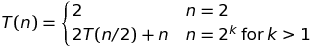
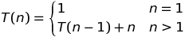

# Solutions to Chapter 2: Getting Started
Introduction to Algorithms
<!-- vscode-markdown-toc -->
* [2.1 Insertion Sort](#InsertionSort)
	* [2.1 - 1](#)
	* [2.1 - 2 Nondecrising Insertion Sort](#NondecrisingInsertionSort)
	* [2.1 - 3 Linear Search](#LinearSearch)
		* [Pseudo Code](#PseudoCode)
		* [Loop variant](#Loopvariant)
	* [2.1 - 3 Adding binary integers](#Addingbinaryintegers)
		* [Stating the problem](#Statingtheproblem)
		* [Solving the problem](#Solvingtheproblem)
* [2.2 Analyzing Algorithms](#AnalyzingAlgorithms)
	* [2.2 – 1](#-1)
	* [2.2 – 2 Selection Sort](#SelectionSort)
		* [Implementation](#Implementation)
		* [Loop invariant](#Loopinvariant)
		* [Only running for n-1 Elements](#Onlyrunningforn-1Elements)
		* [2.3 – Analyzing Linear Seach](#AnalyzingLinearSeach)
		* [Good best case running time](#Goodbestcaserunningtime)
	* [2.3 – Designing Algorithms](#DesigningAlgorithms)
		* [[Not in the book] Implementation of Merge Sort](#NotinthebookImplementationofMergeSort)
		* [2.1 – Merge Sort by hand](#MergeSortbyhand)
		* [2.2 – Merge Sort without sentinels](#MergeSortwithoutsentinels)
		* [2.3 – 3 Mathematical Induction Proof](#MathematicalInductionProof)
		* [2.3 – 4 Recurrence, Insertion Sort](#RecurrenceInsertionSort)
		* [2.3 – 5 Binary Search](#BinarySearch)
		* [2.3 – 6 Combining Insertion Sort and Binary Search?](#CombiningInsertionSortandBinarySearch)
		* [2.3 – 7 Sum search](#Sumsearch)

<!-- vscode-markdown-toc-config
	numbering=false
	autoSave=true
	/vscode-markdown-toc-config -->
<!-- /vscode-markdown-toc -->

## <a name='InsertionSort'></a>2.1 Insertion Sort
### <a name=''></a>2.1 - 1
```python
a = [31, 41, 59, 26, 41, 58]
a = [31, 41, 59, 26, 41, 58]  # 41 and 31 dont switch
a = [31, 41, 59, 26, 41, 58]  # 59 and 41 dont switch
a = [26, 31, 41, 59, 41, 58]  # 26 gets to the beginning
a = [26, 31, 41, 41, 59, 58]  # insert 41
a = [26, 31, 41, 41, 58, 59]  # 58 and 59 switch
```
### <a name='NondecrisingInsertionSort'></a>2.1 - 2 Nondecrising Insertion Sort
```python
arr = [0, 2, 3, 1, 29]
for j in range(1, len(arr)):
    key = arr[j]
    # Insert arr[j] into the sorted sequence arr[:j-1].
    i = j - 1
    while i >= 0 and arr[i] < key:
        arr[i + 1] = arr[i]
        i -= 1
    arr[i+1] = key
# arr: [29, 3, 2, 1, 0]
```
### <a name='LinearSearch'></a>2.1 - 3 Linear Search
#### <a name='PseudoCode'></a>Pseudo Code
```python
def linear_search(arr, search_key):
    for idx in range(len(arr)):
        if arr[idx] == search_key:
            return idx
    return None

arr = [0, 2, 3, 1, 29]

search_key = 7
linear_search(arr, search_key)
>>> None

search_key = 3
linear_search(arr, search_key)
>>> 2
```
#### <a name='Loopvariant'></a>Loop variant
##### Initialization
The subarray arr = [] does indeed not hold the search_key (since it has no values),
thus the loop nvariant holds prior to the first iteration of the loop.
##### Maintenance
Next we show, that linear_search remains true, before the next iteration.
We compare the current value of arr[idx] with the search_key.  
Should arr[idx] equal the search_key, we return the idx.
And thus end the loop and return a valid response.
Should arr[idx] be unequal to the seach_key, we add one to the current idx.  
We thus know, that the search_key is not inside the subarr arr[:idx].  
By incrementing the idx with one, the loop invariant still holds. 
##### Termination
The loop terminates, once `idx > len(arr) - 1 == n`.
Because each loop iteration increases idx by 1, we must have `idx = n +1` at that time.
Substituting n + 1 for idx in the wording of loop invariant, we have that the subarray arr[:idx] consists of the elements originally in arr[:n].
Observing that the subarray arr[:n] is the entire array, we conclude that the entire array does either not contain the search_key, we thus return None
or contains the search_key, if that should be the case, we have stopped the loop (through returning) once arr[idx] == search_key.
Hence, the algorithm is correct.

### <a name='Addingbinaryintegers'></a>2.1 - 3 Adding binary integers
#### <a name='Statingtheproblem'></a>Stating the problem
**Input:** Two arrays A and B of length *n*, containing binary integers. 
**Output:** The sum of A and B, stored in an array C with length *n+1*.
#### <a name='Solvingtheproblem'></a>Solving the problem
```python
def adding_binary_int(a:list, b:list):
    # a and b have the same length
    c = [0] * (len(a) + 1)
    for idx in range(len(a)-1, -1, -1):
        v = a[idx] + b[idx] + c[idx+1]
        c[idx+1] = v%2
        if v > 1:
            c[idx] = 1
    return c

a = [1, 1]
b = [1, 1]
adding_binary_int(a, b)
>>> [1, 1, 0]

a = [0, 1]
b = [1, 0]
adding_binary_int(a, b)
>>> [0, 1, 1]
```
## <a name='AnalyzingAlgorithms'></a>2.2 Analyzing Algorithms
### <a name='-1'></a>2.2 – 1
f(x) = n^3 / 1000 * 100n^2 * 100n + 3  
Θ(n^3)
### <a name='SelectionSort'></a>2.2 – 2 Selection Sort
#### <a name='Implementation'></a>Implementation
```python
def selection_sort(arr):
    for idx in range(len(arr)-1):
        smallest = float('inf')
        smallest_idx = None
        for s_idx in range(idx, len(arr)):
            if arr[s_idx] < smallest:
                smallest = arr[s_idx]
                smallest_idx = s_idx
        print(f'idx:{idx} smaallest: {smallest} s_idx: {smallest_idx}')
        arr[smallest_idx] = arr[idx]
        arr[idx] = smallest
    return arr

arr = [0, 4, 23, 5, 23, 54]
selection_sort(arr)
>>> [0, 4, 5, 23, 23, 54]

arr = [31, 41, 59, 26, 41, 58]
selection_sort(arr)
>>>> [26, 31, 41, 41, 58, 59]
```
#### <a name='Loopinvariant'></a>Loop invariant
##### Initialization
Selection sort, finds the n*th* smallest element. We denote n here as `idx`. Before the first loop starts idx is 0, thus `arr[:idx] = arr[:0] = []`,
which indeed is a sorted array, since it is empty.
###### Maintenance
Since, once `idx` increases by one, we loop through the array again to check, what element is the smallest one, and append this element to the idx*th* postion of the array.
We make sure, that the array `arr[:idx]` always contains a increasing order of elements of the smallest elements in the array.
###### Termination
The loop terminates, once `idx` is greater than `len(arr) - 1`. We thus know, that `idx = len(arr)` and that the array `arr[:idx] = arr[:-1]` is a sorted array in increasing order.
Moreover, since we know, that the all elements with `arr[:-1]` are the smallest elements within the array,
we know, that the last element of the array `arr[len(arr)]` is also the greatest element within the array.
Thus, we can conclude, that the array `arr[:len(arr)]` is a sorted array.
Observing that the subarray `arr[:len(arr)]` is the entire array, we conclude that the entire array is sorted.
Hence, the algorithm is correct.

#### <a name='Onlyrunningforn-1Elements'></a>Only running for n-1 Elements
Selection Sort only needs to run for n-1 elements as opposed to n elements.  
Because, after picking the smallest element before, we know, that the n*th* elment is going to be the biggest element in the array.
Thus, we don't need to check it again. (There would also be no elements left, to compare the n*th* elment to)
##### Running time
The best and worst case for selection sort (without improvments) is the same.  

Since we first loop through the array once, to find the smallest / second smallest / third smallest / ... element.  
While trying to find that element, we loop through the array once more.
Selection Sort has a runtime of Θ(n^2), where n denotes the length of the array.
<!-- Thus Θ(n), where n denotes the length of the array, for the outer loop.  
Times Θ(n) for the inner loop, to find the smallest element in the remaining array.
Hence, Θ(n) * Θ(n) = Θ(n^2). -->
#### <a name='AnalyzingLinearSeach'></a>2.3 – Analyzing Linear Seach
##### Best Case
The best case of linear search would be, that the search_key would be the first elment of the array that we check.  
Thus, we would only need to compare the first element of the array, no matter the length,
which would result in Θ(1).
##### Worst Case
The worst case of linear search would be, that the search_key would be the last element of the array, that we check.
Thus, we would first compare n elments, where n denotes the length of the array, before finding our search_key.
This would result in Θ(n).
##### Average Case
Seeing that on average the search_key is anywhere in the array and we have a chance of 1/n to be finding it at a specific index.
(where n denotes the length of the array). We on average find the key after checking half the array, since `n/2 * 1/n = 1/2 = 50%`.
Thus Θ(n/2), and since constant factors in Big O are ignored:  
Θ(n).
#### <a name='Goodbestcaserunningtime'></a>Good best case running time
We just assume, that the input already has the properties, that we expect the output to have.
We then just check, whether this is the case, and maybe make some minor changes.
Those changes can be costly, since we only care about the best case running time, we assume, that these changes, will not happen.
### <a name='DesigningAlgorithms'></a>2.3 – Designing Algorithms
#### <a name='NotinthebookImplementationofMergeSort'></a>[Not in the book] Implementation of Merge Sort
```python
def merge_sort(arr, l, r):
    if l < r:
        m = (l + r) // 2
        arr = merge_sort(arr, l, m)
        arr = merge_sort(arr, m+1, r)
        merge(arr, l, m, r)
        return arr
    return arr

def merge(arr, l, m, r):
    L = arr[l:m]
    R = arr[m:r]
    L.append(float('inf'))
    R.append(float('inf'))
    print(f'arr: {arr[l:r]}\nL:{L} R: {R} ')
    i, j = 0, 0
    for k in range(l, r):
        if L[i] <= R[j]:
            arr[k] = L[i]
            i += 1
        else:
            arr[k] = R[j]
            j += 1
    return arr

arr = [0, 4, 23, 5, 23, 54]
merge_sort(arr, 0, len(arr))
>>> [0, 4, 5, 23, 23, 54]

arr = [31, 41, 59, 26, 41, 58]
merge_sort(arr, 0, len(arr))
>>> [26, 31, 41, 41, 58, 59]
```
#### <a name='MergeSortbyhand'></a>2.1 – Merge Sort by hand
```python
A=[3, 41, 52, 26, 38, 57, 9, 49]  # merge and combine
  [3, 41, 26, 52][9, 38, 49, 57]  
  [3, 41][26, 52][38, 57][9, 49]
```
#### <a name='MergeSortwithoutsentinels'></a>2.2 – Merge Sort without sentinels
```python
def merge_sort(arr, l, r):
    if l < r:
        m = (l + r) // 2
        arr = merge_sort(arr, l, m)
        arr = merge_sort(arr, m+1, r)
        merge(arr, l, m, r)
        return arr
    return arr

def merge(arr, l, m, r):
    L = arr[l:m]
    R = arr[m:r]
    i, j = 0, 0
    for k in range(l, r):
        if i == len(L):
            arr[k:r] = R[j:]
            break
        if j == len(R):
            arr[k:r] = L[i:]
            break
        if L[i] <= R[j]:
            arr[k] = L[i]
            i += 1
        else:
            arr[k] = R[j]
            j += 1
    return arr

arr = [0, 4, 23, 5, 23, 54]
merge_sort(arr, 0, len(arr))
>>> [0, 4, 5, 23, 23, 54]

arr = [31, 41, 59, 26, 41, 58]
merge_sort(arr, 0, len(arr))
>>> [26, 31, 41, 41, 58, 59]
```
#### <a name='MathematicalInductionProof'></a>2.3 – 3 Mathematical Induction Proof

##### Base Case
Let n be 2 (2^1), then T(2) by the definition equals 2, which indeed is 2*lg(2) = 2*1 = 2.
##### Inductive Case
For the inductive case, assume that all T(n) hold, where n denotes an exact power of 2.  
Then T(2*n) also holds, since:  
```
T(2n)   = 2 * T(2n/2) + 2n
        = 2 * (lg(n) + n) + 2n
        = 2 * lg(n) + 2n + 2n
        = 2 * (lg(n) + 2n)
        = 2 * T(n)
```
By establishing the truth for the case case and all 2*n cases, the statement holds for all n=2^k, where k denotes a natural number.
#### <a name='RecurrenceInsertionSort'></a>2.3 – 4 Recurrence, Insertion Sort

where n denotes the length of the array.
#### <a name='BinarySearch'></a>2.3 – 5 Binary Search
##### Implementation
```python
def binary_search_recursive(arr, search_key):
    print(arr)
    if len(arr) == 0:
        return False
    m = (0 + len(arr)) // 2
    # if len(arr) == 1, then m = 0
    if len(arr) == 1:
        if arr[0] == search_key:
            return 0
        else:
            return False
    if arr[m] == search_key:
        return m
    else:
        if arr[m] > search_key:
            # search left
            return binary_search_recursive(arr[:m], search_key)
        else:
            # search right
            res = binary_search_recursive(arr[m+1:], search_key)
            return m + 1 + res if res == False else False
        
def binary_search_iterative(arr, search_key):
    l = 0
    r = len(arr)
    found = False
    while l < r:
        m = (l + r) // 2
        if arr[m] == search_key:
            return m
        else:
            if arr[m] < search_key:
                # search right
                l = m + 1
            else:
                # search left
                r = m
    return False

arr = [0, 4, 5, 23, 23, 54]
binary_search_recursive(arr, 5)
>>> 2
binary_search_iterative(arr, 5)
>>> 2

arr = [0, 4, 5, 23, 23, 54]
binary_search_recursive(arr, 55)
>>> False
binary_search_iterative(arr, 55)
>>>> False
```
##### Running time
The worst case for binary search would be to not find the `search_key` in the array.
In this case, we could have to make sure, that there is no possibility of the value of the `search_key` to be in the array.
During each iteration of running binary search we half the elments, we check, thus giving as a worst running time of O(lg(n)).
#### <a name='CombiningInsertionSortandBinarySearch'></a>2.3 – 6 Combining Insertion Sort and Binary Search?
No, we cannot combine Insertion Sort and Binary Search, since Binary Search requires a sorted array.  
But we try to find the smallest value in the subarray A[j:n], which is not yet sorted.  
#### <a name='Sumsearch'></a>2.3 – 7 Sum search
##### Using Sets O(n)
```python
def sum_search(S, x):
    for n in S:
        if x-n in S:
            return n, x-n
    return False

S = {3, 2, 32, 12, 4, 43}
sum_search(S, 5)
>>> 2, 3

sum_search(S, 12)
>>> False
```